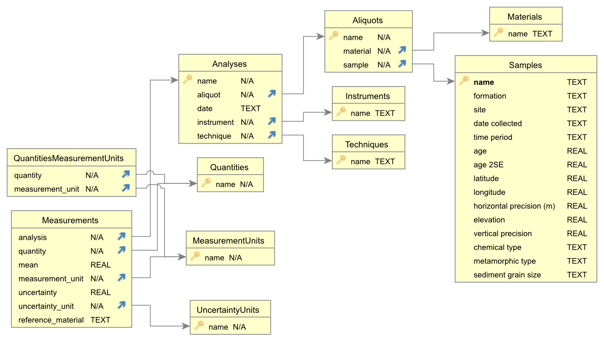

# pygeodb

This python module provides a class and methods for adding, updating, and reading data from a SQLite database. It is geared towards a database of geochemical measurements on geologic materials, but it will be as general as possible with respect to admit a variety of data sources.

A minimal SQLite schema for utilizing this package is presented below and available in this repository as [schema.sql](schema.sql). [SQLiteStudio](https://sqlitestudio.pl/) provides a convenient way to access and modify SQLite databases.

## Installation
In progress...

## SQLite Schema

The schema presented below is largely inspired by the following references:

> Chamberlain, K.J., Lehnert, K.A., McIntosh, I.M., Morgan, D.J., and Wörner, G., 2021, Time to change the data culture in geochemistry: Nature Reviews Earth & Environment, v. 2, p. 737–739, doi:10.1038/s43017-021-00237-w.
>
> Staudigel, H. et al., 2003, Electronic data publication in geochemistry: Geochemistry, Geophysics, Geosystems, v. 4, doi:10.1029/2002GC000314.

Full implementation of the metadata collection described therein is a work-in-progress, but this schema captures the most important elements.

### Primary Tables

The geochemical data are assumed to follow a hierarchy that progresses from
**sample → aliquot → analysis → measurement**. Various metadata are tabulated at each level. This structure is presented here and in the [guide](guide.ipynb) with the example of split-stream laser ablation mass spectrometry (LASS-ICPMS) of zircon.

**`Samples`**

Samples are uniquely identified by names and contain metadata. Minimal metadata for a
sample include:
- latitude and longitude
- horizontal precision
- elevation
- vertical precision

In this example, the sample would be the rock from which zircons are separated.  

**`Aliquots`**

Aliquots reflect portions of a sample and have a many-to-one (foreign key) relationship with the `Samples` table. Minimal metadata for an aliquot include:
- material (e.g., whole rock, zircon, etc.)

In the example, an aliquot would be a single laser ablation spot on an individual zircon. In general, an aliquot is a part of a sample that undergoes analysis.

**`Analyses`**

Analyses are analytical events that yield measurements. In the case of LASS-ICPMS, a single spot (aliquot) yields analyses on two separate instruments: one that measures trace elements, another that measures U and Pb. Analyses must include:
- date
- instrument
- technique

**`Measurements`**

Measurements store the geochemical data gathered during analyses. A row exists in the
`Measurements` table for each element, ratio, or other value measured/derived during an
analysis. For now, measurements are uniquely identifiable soley by the analysis and the
quantity being measured. Measurements must include:
- measurement unit
- uncertainty unit
- reference material

### Auxiliary Tables
The following tables provide valid values and combinations of values for several of the metadata fields described above to facilitate data validation and consistency.

`Quantities`

This table lists valid quantities that can be included in `Measurements`, such as elemental concentrations, ratios, and error correlations. 

`MeasurementUnits`

This table specifies valid units for `Measurements`, such as ppm, wt pct, etc. 

`QuantitiesMeasurementUnits`

This table encodes a many-to-many relationship between `Quantities` and
`MeasurementUnits`, thereby specifying the valid combinations of the two values. For example, ratios cannot be measured in ppm, and so the only valid `measurement_unit` for the `quantity` U/Th would be a ratio.

`Instruments`

This table records the instruments that yield measurements during analyses. Every analysis must have an instrument.

`Techniques`

Valid analytical techniques are tabulated here. The same instrument can be used in different ways; for example ICPMS measurements can be done on laser ablation aerosols or solutions. This table records these methodological distinctions.

`Materials`

Rock samples can yield various materials. An aliquot is a particular material, for example a zircon, and this table contains all the valid materials that aliquots can be.